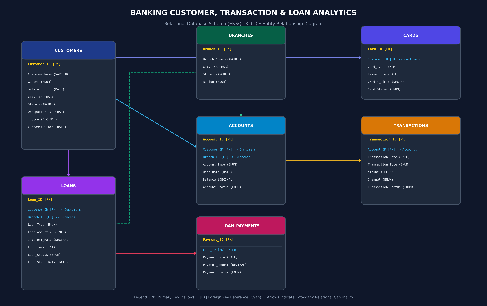

# Banking Customer, Transaction & Loan Analytics using SQL

[](https://www.mysql.com/)
[]()
[]()
[]()

A complete, production-grade, and interview-ready SQL Business Analytics portfolio project built from scratch using **MySQL 8+**. This project simulates an enterprise retail and commercial banking environment comprising **5,000 customers**, **50 branches**, **7,000 accounts**, **105,000+ transactions**, **3,000 loans**, **79,000+ loan payments**, and **5,200 cards**.

---

## Project Overview

Modern financial institutions process millions of transactions daily across diverse channels while managing credit risk and customer relationships. This project demonstrates how advanced relational database design and complex SQL queries transform raw banking operational ledgers into strategic business intelligence.

---

## Business Problem

Executive banking leadership faces key business questions:
1. **Customer Segmentation & Wealth Skew**: Which customer cohorts hold the majority of deposit balances, and where are high-net-worth opportunities concentrated?
2. **Channel Economics & Migration**: Are customers adopting low-cost digital payment rails (UPI/Mobile Banking), or is branch footfall driving high operational servicing costs?
3. **Credit Risk & Asset Quality**: What is the portfolio default rate across retail vs commercial loans, and what early delinquency indicators exist in loan repayment schedules?
4. **Branch Performance**: Which geographic branches lead in deposit mobilization versus loan origination?
5. **Cross-Sell Penetration**: Which customers hold multi-product relationships (deposits, credit cards, mortgages)?

---

## Objectives

* **Design a 3NF Normalized Relational Schema** with primary/foreign keys, check constraints, default values, and B-Tree indexes.
* **Generate a Consistent, Scalable Synthetic Dataset** reflecting authentic Indian banking distributions, realistic salaries, transaction frequencies, loan amortizations, and delinquency profiles.
* **Enforce Strict Data Quality Audits** through 14 validation scripts checking referential integrity, temporal logic, and range constraints.
* **Execute 38+ Structured Analytical Queries** demonstrating window functions (`DENSE_RANK`, `ROW_NUMBER`, `LAG`, `LEAD`, `SUM() OVER`), Common Table Expressions (CTEs), multi-table joins, conditional aggregations, and running totals.
* **Deliver C-Suite Strategic Insights** with data-driven recommendations for retail banking leadership.

---

## Dataset Summary

| Table Name | Primary Key | Foreign Key(s) | Record Count | Description |
|---|---|---|---|---|
| **`Customers`** | `Customer_ID` | None | **5,000** | Master customer demographic and income profile |
| **`Branches`** | `Branch_ID` | None | **50** | Bank branch locations and geographical regions |
| **`Accounts`** | `Account_ID` | `Customer_ID`, `Branch_ID` | **7,000** | Savings, Current, Salary, and Fixed Deposit accounts |
| **`Transactions`**| `Transaction_ID` | `Account_ID` | **105,000** | Omnichannel transaction logs (UPI, ATM, NEFT, Branch) |
| **`Loans`** | `Loan_ID` | `Customer_ID`, `Branch_ID` | **3,000** | Credit contracts (Home, Auto, Personal, Business loans) |
| **`Loan_Payments`**| `Payment_ID` | `Loan_ID` | **79,060** | Granular installment/EMI collection audit records |
| **`Cards`** | `Card_ID` | `Customer_ID` | **5,200** | Credit, Debit, Prepaid, and Corporate card portfolios |

---

## Database Schema (ER Diagram)

The entity relationships are strictly enforced with foreign key cascading and validation rules.



```
[Customers] ──< [Accounts] ──< [Transactions]
     │               │
     ├──< [Loans] ───┴──< [Loan_Payments]
     │      │
     │      └──> [Branches]
     │
     └──< [Cards]
```

---

## Data Quality Checks

Before analytical reporting, data integrity was verified across 14 checkpoints in `database/04_data_quality_checks.sql`:

- [x] **Zero NULL Identifiers**: Critical IDs (`Customer_ID`, `Account_ID`, `Transaction_ID`, `Loan_ID`) audited.
- [x] **Zero Duplicate Primary Keys**: Grouped validation with `HAVING COUNT(*) > 1`.
- [x] **Zero Orphaned Foreign Keys**: `LEFT JOIN` checks confirming all child records map to existing parents.
- [x] **Positive Value Constraints**: Verified non-negative transaction amounts, positive loan principals, and valid balances.
- [x] **Temporal Date Consistency**: Verified `Open_Date >= Customer_Since`, `Transaction_Date >= Open_Date`, and `Payment_Date >= Loan_Start_Date`.
- [x] **Domain Enum Validity**: Audited all status categories for accounts, transactions, loans, and card instruments.
- [x] **Interest Rate Outlier Detection**: Confirmed all interest rates reside within valid boundaries (1.0% – 40.0%).

---

## Business Questions Answered

### Customer Analysis (Queries 1–10)
1. Total customer count and demographic sizing.
2. Gender distribution and percentage share.
3. State-wise customer distribution across India.
4. Regional geographic concentration (North, South, East, West, Central).
5. Occupation breakdown and income distribution.
6. Average, minimum, maximum, and standard deviation of customer incomes.
7. Customer loyalty cohorts based on relationship tenure.
8. Customers holding multiple bank accounts.
9. Retail lending penetration across customer base.
10. Cross-sold customers holding both active loans and card products.

### Account & Deposit Analysis (Queries 11–18)
11. Total active deposit accounts managed.
12. Portfolio balance distribution by account type (Savings, Current, Salary, FD).
13. Active vs Inactive vs Dormant account proportions.
14. Average and maximum balance metrics per product line.
15. Aggregate bank-wide customer deposit liabilities.
16. Top 10 High Net-Worth Individuals (HNIs) by total deposits.
17. Branch-level deposit mobilization ranking.
18. Multi-account ownership breakdown and combined balances.

### Transaction Velocity & Channel Analysis (Queries 19–28)
19. Gross transaction volume across the network.
20. Total monetary transaction value processed.
21. Deposits vs Withdrawals vs Transfers comparative analysis.
22. Channel breakdown (UPI, ATM, Net Banking, Mobile Banking, NEFT, IMPS, Branch, POS).
23. Monthly transaction velocity and seasonal volume flow.
24. Regional transaction activity and customer participation.
25. Top 10 most active transacting customers.
26. Top 10 customers by gross transaction throughput.
27. Cross-tabulation of average ticket size across channels and account types.
28. System transaction success vs decline rate analysis.

### Loan Portfolio & Delinquency Analysis (Queries 29–38)
29. Total disbursed loan portfolio capital book.
30. Loan product volume distribution.
31. Capital allocation across Home, Auto, Business, Personal, Education, and Gold loans.
32. Product ticket size boundaries and average tenures.
33. Portfolio asset classification (Active, Closed, Defaulted, In Arrears).
34. Non-Performing Asset (NPA) and capital default rate calculations.
35. Branch-level credit exposure and delinquency rates.
36. Top 10 single-borrower loan exposure concentration.
37. Weighted average interest rates and portfolio yield margins.
38. Granular EMI installment collection performance (Paid on time vs Late vs Failed).

---

## SQL Techniques Used

* **Common Table Expressions (CTEs)**: Modular multi-level data preparation (`WITH ...`).
* **Window Functions**:
  * `DENSE_RANK()`: Ranking customers and branch deposits without skipping ranks.
  * `ROW_NUMBER()`: Regional top customer identification with `PARTITION BY Region`.
  * `LAG()`: Month-over-Month (MoM) transaction growth velocity calculation.
  * `SUM() OVER (...)`: Cumulative running transaction totals over time.
* **Conditional Logic**: Multi-tiered `CASE WHEN` for balance segmentation and analytical loan risk classification.
* **Relational Joins**: `INNER JOIN`, `LEFT JOIN`, and Multi-table joined aggregations.
* **Aggregate Functions & Grouping**: `GROUP BY`, `HAVING`, `COUNT(DISTINCT)`, `ROUND()`, `COALESCE()`, `NULLIF()`.
* **Date Manipulation**: `DATE_FORMAT()`, `TIMESTAMPDIFF()`, `TIMESTAMPDIFF(YEAR, ...)`.

---

## Key Findings & Strategic Insights

1. **Wealth Concentration (The 25/72 Skew)**: Top-tier **Premium customers (25.38% of base)** hold **71.93% of total bank deposits** (~₹2.66 Billion).
2. **Channel Separation**: **UPI processes 37.94% of transaction volume** with an average ticket size of ₹5,500.66, whereas **NEFT and physical Branch visits account for 57.01% of total transaction value** (average ticket sizes of ₹125k and ₹250k).
3. **Credit Portfolio Quality**: **Home Loans represent 63.38% of total disbursed capital** (₹5.04 Billion) with the lowest default rate (**6.76%**). Conversely, unsecured **Personal Loans exhibit an elevated default rate of 9.54%**.
4. **Regional Balance**: Deposit mobilization is well-distributed across Central (₹8.28B), West (₹8.25B), North (₹8.22B), East (₹8.21B), and South (₹7.61B).

*Detailed figures and tables are documented in [documentation/business_insights.md](documentation/business_insights.md) and [screenshots/query_output_samples.md](screenshots/query_output_samples.md).*

---

## Project Structure

```
banking-sql-analytics/
├── README.md                           # Master Project Documentation
├── TITLE.md                            # Quick Reference Portfolio Title Card
│
├── data/                               # Generated Relational CSV Datasets
│   ├── customers.csv                   # 5,000 Customers
│   ├── branches.csv                    # 50 Branches
│   ├── accounts.csv                    # 7,000 Accounts
│   ├── transactions.csv                # 105,000 Transactions
│   ├── loans.csv                       # 3,000 Loans
│   ├── loan_payments.csv               # 79,060 Loan Payments
│   └── cards.csv                       # 5,200 Cards
│
├── database/                           # MySQL DDL, Ingestion & Quality Scripts
│   ├── 01_create_database.sql          # DB Initialization & UTF-8 setup
│   ├── 02_create_tables.sql            # Table DDL, Constraints, Foreign Keys & Indexes
│   ├── 03_insert_data.sql              # LOAD DATA LOCAL INFILE import scripts
│   └── 04_data_quality_checks.sql      # 14 Data Quality & Integrity Validation Queries
│
├── queries/                            # Structured Business & Advanced Analytics SQL
│   ├── 01_customer_analysis.sql        # Questions 1 to 10
│   ├── 02_account_analysis.sql         # Questions 11 to 18
│   ├── 03_transaction_analysis.sql     # Questions 19 to 28
│   ├── 04_loan_analysis.sql            # Questions 29 to 38
│   ├── 05_advanced_sql.sql             # 10 Advanced Window Function & CTE Queries
│   └── 06_business_insights.sql        # Executive Summary & Portfolio KPI Queries
│
├── documentation/                      # Enterprise Documentation & Career Assets
│   ├── database_schema.png             # Visual High-Res ER Diagram
│   ├── data_dictionary.md              # Full Column Data Dictionary & Business Definitions
│   ├── business_insights.md            # Verified Data Metrics & Strategic Recommendations
│   ├── resume_description.md           # 3 ATS-Optimized Resume Bullet Points
│   ├── linkedin_post.md                # Ready-to-Publish Showcase Post
│   └── interview_questions.md          # 28 Interview Q&As for Data/Business Analysts
│
├── scripts/                            # Python Utility Scripts
│   ├── generate_data.py                # Synthetic Data Generator Script
│   ├── generate_er_diagram.py          # High-Res ER Diagram Generator
│   ├── verify_and_compute_metrics.py   # Dataset Verification & Metric Calculator
│   └── generate_query_output_samples.py# Query Output Markdown Table Generator
│
└── screenshots/                        # Visual Artifacts & Sample Query Outputs
    ├── README.md                       # Workbench Screenshot Capture Guide
    └── query_output_samples.md         # Formatted Output Tables of Key Queries
```

---

## How to Run the Project

### Prerequisites
* **MySQL Server 8.0+** installed locally ([Download MySQL Community Server](https://dev.mysql.com/downloads/mysql/)).
* **MySQL Workbench**, **DBeaver**, or **DataGrip**.
* Optional: Python 3.8+ (if you wish to re-generate the CSV files).

### Step-by-Step Execution Guide

#### Step 1: Clone the Repository
```bash
git clone https://github.com/your-username/banking-sql-analytics.git
cd banking-sql-analytics
```

#### Step 2: Initialize Database & Schema
Open **MySQL Workbench** or your MySQL CLI client and run:
```sql
-- 1. Create the database
SOURCE database/01_create_database.sql;

-- 2. Build the relational tables, constraints, and indexes
SOURCE database/02_create_tables.sql;
```

#### Step 3: Load Data
**Option A — Direct SQL `LOAD DATA LOCAL INFILE`**:
Ensure `local_infile` is enabled on your server:
```sql
SET GLOBAL local_infile = 1;
```
Open `database/03_insert_data.sql`, update the absolute file path to match your local directory, and run the script.

**Option B — MySQL Workbench Table Data Import Wizard**:
Right-click each table in MySQL Workbench $\rightarrow$ **Table Data Import Wizard** $\rightarrow$ select the corresponding CSV file from the `data/` folder in the following order:
1. `branches.csv`
2. `customers.csv`
3. `accounts.csv`
4. `loans.csv`
5. `cards.csv`
6. `transactions.csv`
7. `loan_payments.csv`

#### Step 4: Run Data Quality Checks
Execute the quality assurance suite to ensure 100% data cleanliness:
```sql
SOURCE database/04_data_quality_checks.sql;
```

#### Step 5: Execute Analytical Queries
Run the analytical query modules in sequence:
```sql
SOURCE queries/01_customer_analysis.sql;
SOURCE queries/02_account_analysis.sql;
SOURCE queries/03_transaction_analysis.sql;
SOURCE queries/04_loan_analysis.sql;
SOURCE queries/05_advanced_sql.sql;
SOURCE queries/06_business_insights.sql;
```

---

## Skills Demonstrated

* **Relational Database Architecture**: 3NF normalization, constraint enforcement, and index tuning.
* **Advanced Query Engineering**: Complex CTE pipelines, Window Functions (`DENSE_RANK`, `LAG`, `ROW_NUMBER`, `SUM OVER`), partitioned analytics.
* **Financial Analytics**: Asset quality metrics, default rate calculations, customer wealth segmentation, channel migration analysis.
* **Data Quality Engineering**: Automated verification of temporal logic, foreign key integrity, and boundary conditions.
* **Business Storytelling**: Translating raw tabular query outputs into actionable recommendations for banking leadership.

---

## Limitations

* **Synthetic Data Environment**: While statistically modeled after Indian banking benchmarks, the data does not capture real-world operational edge cases such as chargeback reversals, complex fee structures, or international foreign exchange.
* **Static Balances**: Account balances reflect point-in-time snapshots rather than continuously fluctuating daily ledger reconciliations.
* **Analytical Risk Proxy**: Delinquency tiers are derived from synthetic repayment patterns and do not incorporate external credit bureau ratings (CIBIL/Experian).

---

## Future Improvements

* [ ] Build an automated **Python / Airflow daily ETL pipeline** to stream incremental daily transaction files into MySQL.
* [ ] Implement **Database Stored Procedures and Triggers** to auto-reconcile account balances upon new transaction insertion.
* [ ] Integrate an interactive **Streamlit or FastAPI analytical dashboard** connecting directly to the MySQL database.
